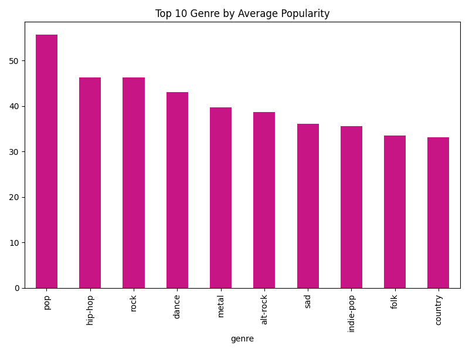
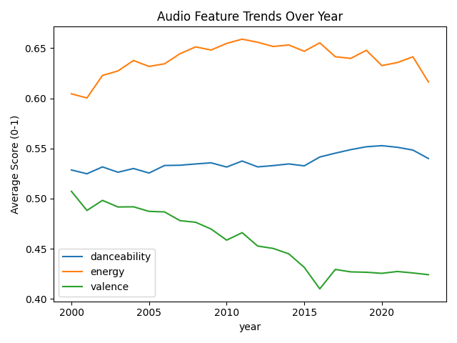
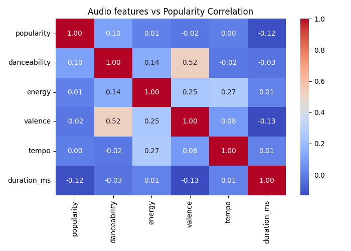
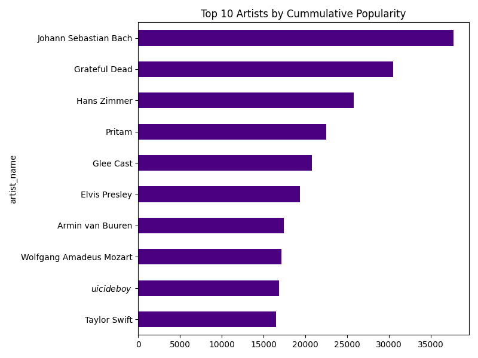
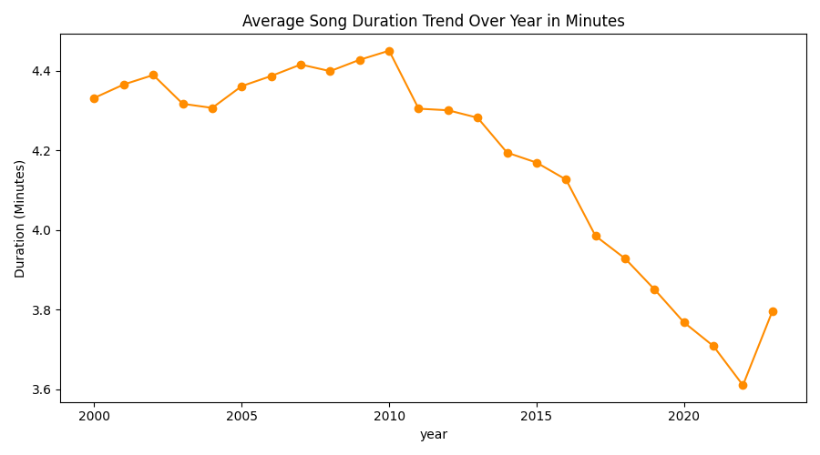

# Spotify Music Trends Analysis

This project performs a comprehensive exploratory data analysis (EDA) on a Spotify dataset to discover trends in music over time, audio features, genre popularity, and artist success.

## Project Structure

- `Graphs/`: Contains the visualizations and plots generated during the analysis (e.g., genre popularity, audio trends, correlation heatmaps).
- `Raw Dataset/`: Stores the primary data file (`spotify_data.csv`) used for the analysis.
- `Spotify_Analysis.py`: The main Python script that performs data loading, cleaning, analysis, and visualization.
- `logger_setup.py`: A utility script that configures the logging mechanism for the project.
- `spotify_analysis.log`: The log file generated by the script, containing the output of the data analysis, EDA results, and descriptive statistics.

## Analysis Overview

The analysis script (`Spotify_Analysis.py`) is designed to answer the following key questions:
1. **Genre Popularity**: Which are the top 10 genres based on average popularity?
2. **Audio Feature Trends**: How have audio features like danceability, energy, and valence changed over the years?
3. **Correlation Analysis**: What is the correlation between popularity and various audio features (tempo, duration, danceability, etc.)?
4. **Top Artists**: Who are the top 10 artists according to cumulative popularity?
5. **Duration Trends**: How has the average duration of songs changed over time?

## How to Run

1. Ensure you have the necessary libraries installed (`pandas`, `numpy`, `matplotlib`, `seaborn`).
2. Run the main analysis script:
   ```bash
   python Spotify_Analysis.py
   ```
3. Check the `spotify_analysis.log` file for detailed textual outputs, statistics, and answers to the questions above.
4. Check the `Graphs/` directory for the generated visualizations (e.g., `genre_popularity.png`, `audio_trends.png`).

## Data Visualizations

### 1. Genre Popularity


### 2. Audio Feature Trends


### 3. Correlation Analysis


### 4. Top Artists


### 5. Duration Trends

